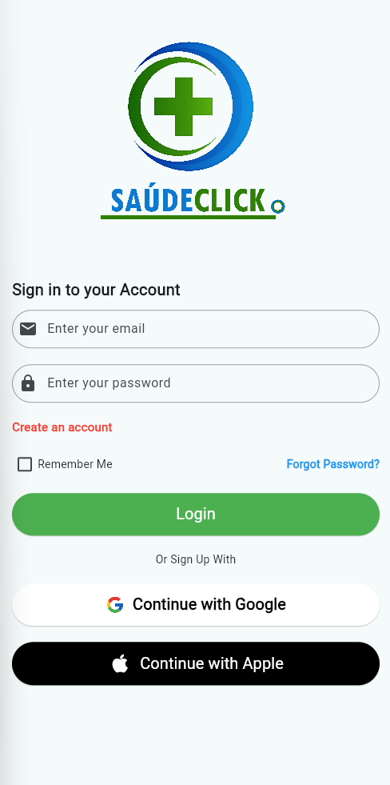
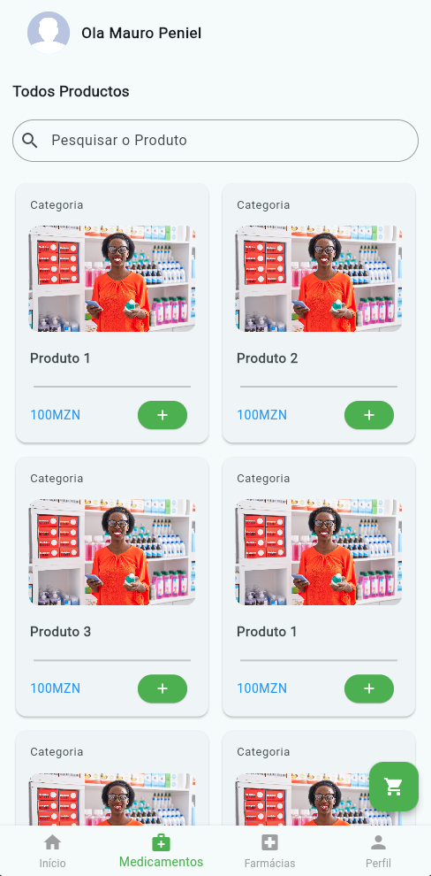
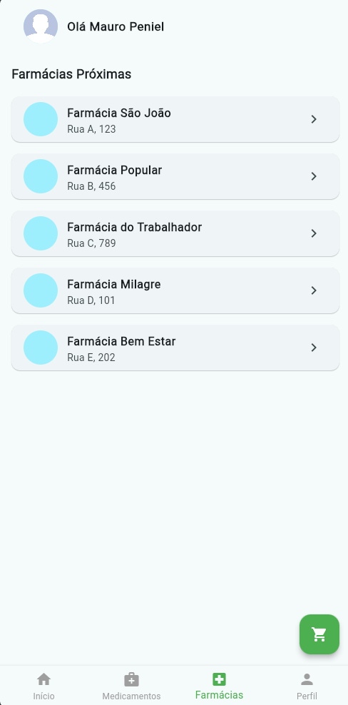
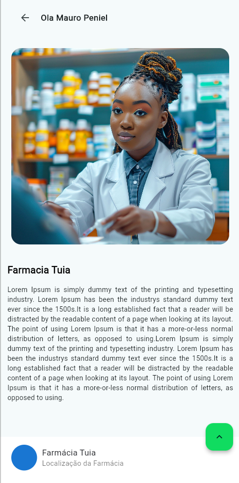
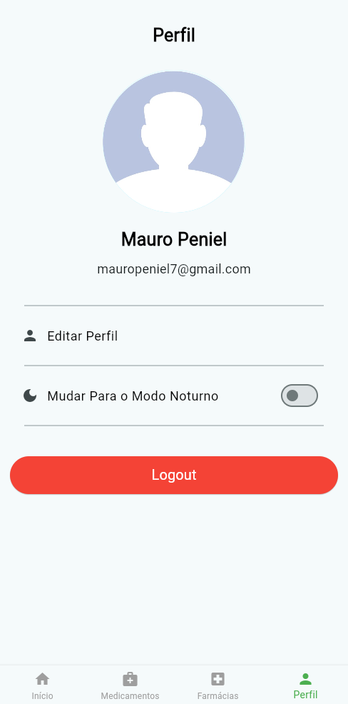

# 🛒 Flutter Loja App - SaudeClick

Este é um aplicativo móvel de loja digital desenvolvido com **Flutter**, permitindo a navegação por categorias, visualização de produtos e interação com uma interface moderna. O app foi projetado como base para um projeto de e-commerce, oferecendo uma experiência intuitiva para o usuário.

## 🚀 Tecnologias Utilizadas

- **Frontend:** Flutter, Dart
- **Componentes UI:** GetWidget
- **Outras Tecnologias:** Widgets do Flutter, Navegação entre telas, Controle de estado

## ⚙️ Funcionalidades

- 🏠 Tela inicial com navegação por categorias
- 🔍 Campo de pesquisa de produtos
- 🛍️ Visualização de produtos em cards interativos
- 🎨 Interface com tema claro e estrutura responsiva
- 💳 Implementação de navegação com **BottomNavigationBar**
- 💡 Suporte para adicionar novos produtos, categorias e gerenciar o carrinho de compras (funcionalidades em desenvolvimento)

## 📸 Capturas de Tela

### 📌 Tela de Login


### 📌 Tela de Bem Vindo


### 📌 Tela Inicial


### 📌 Tela de Productos


### 📌 Tela de Farmacias


### 📌 Tela de Detalhes de Farmacia


### 📌 Tela de Localizacao da Farmacia


### 📌 Tela de Perfil


## 🛠️ Instalação

1. Clone o repositório:
```bash
  git clone https://github.com/restenPiz/SaudeClick.git
  cd school-laravel
```

2. Instale as dependências do Flutter:
```bash
    flutter pub get
```

3. Execute o app :
```bash
  flutter run
```

## 🎯 Próximos Passos

- Implementar integracao com backend (Laravel)
- Implementar a parte de categorias e favoritos
- Integrar metodos de pagamentos
- Integracao com firebase para Auth

## 🤝 Contribuição

Contribuições são bem-vindas! Para contribuir:
1. Faça um fork do projeto
2. Crie uma branch para sua funcionalidade: `git checkout -b minha-feature`
3. Faça commit das mudanças: `git commit -m 'Adicionei uma nova funcionalidade'`
4. Envie para o repositório: `git push origin minha-feature`
5. Abra um Pull Request

## 📜 Licença

Este projeto é licenciado sob a [MIT License](LICENSE).

---

🔗 **Desenvolvido por Mauro Peniel**
